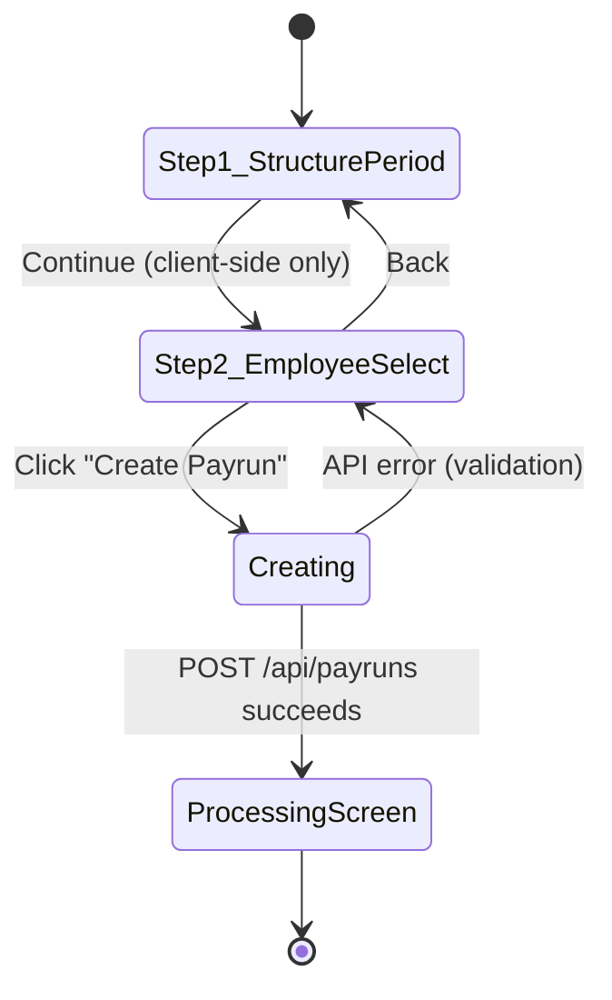
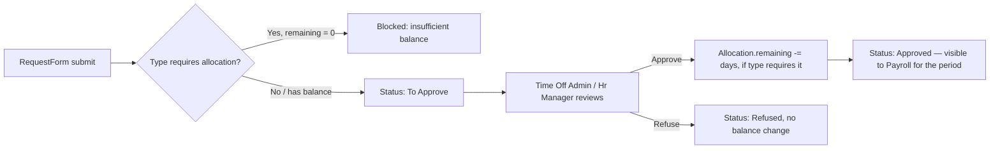
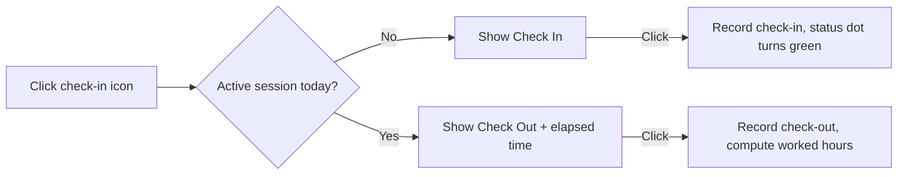
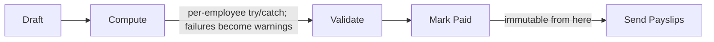

# HRMS OXP — Final Frontend Reference
### Single source of truth for the frontend build. No other document or prior prompt needs to be consulted.

**Project:** HRMS OXP — Odoo-style HR & Payroll platform, built to a 24-hour hackathon scope.
**Source of requirements:** the project's Excalidraw wireframe board (`HRMS OXP – 24 hours`), parsed in full — every screen, field, role, and functional note on that board is reflected below.
**Stack:** React 18 + Vite · Tailwind CSS · React Router v6 · React Hook Form + Zod · TanStack Query · Recharts · Lucide + React Icons · Axios

---

## 1. What this app is

An integrated HR + Payroll system where the **Employee record is the central hub**. Contracts, Attendance, Time Off, and Payroll are connected flows off that hub, not isolated CRUD screens. The two rules that everything else depends on:

1. **Payroll always resolves the contract applicable to the specific pay period** — never just "whatever contract is currently active." An employee can have several contracts over time, but only one may be `Running` for a given period.
2. **Salary is computed from an ordered, configurable set of Salary Rules** inside a Salary Structure — never a hardcoded formula per employee.

Six functional zones, in build order:
`0` Login & User Access → `1` Employee & Contract (+ Working Schedule) → `2` Attendance → `3` Time Off → `4` Payroll (Payrun, Payslips, Structures, Rules) → `5` Payroll Dashboard.

---

## 2. Tech Stack

| Concern | Choice | Reason |
|---|---|---|
| Build tool | Vite | Fast HMR, native ESM, minimal config |
| Styling | Tailwind CSS | Utility-first; theme extended with the design tokens in §4 |
| Routing | React Router v6 | Nested routes match the Employee-as-hub structure (tabs/smart-links) |
| Server state | TanStack Query | Caching/invalidation for CRUD-heavy screens; no hand-rolled loading/error state per page |
| Form state | React Hook Form + Zod | Uncontrolled inputs for perf on long forms (Employee, Contract); Zod schema shared between validation and API error mapping |
| Charts | Recharts | Dashboard KPIs — Salary Cost by Department, Net Salary Trend, Payslip Status split |
| Icons | Lucide (primary) + React Icons (fallback for any glyph Lucide lacks) | Consistent stroke-based icon set |
| HTTP | Axios | Interceptors for JWT attach + 401 handling |
| Auth storage | JWT in memory (React Context), not localStorage | Avoids XSS-exposed token storage in a payroll system |

No Redux: the app's real complexity is server state (TanStack Query) and form state (React Hook Form), not client-only state that needs a global store. A lightweight context is enough for toasts/modal-stack if that ever gets complex.

---

## 3. Roles & Permissions

Roles, exactly as specified on the wireframe board (this is a flat capability map, not a 5-tier hierarchy — e.g. `Time Off Admin` and `Payroll Admin` are siblings, not levels of the same ladder):

| Role | Employee/Contract | Attendance | Time Off | Payrun/Payslip | Structures/Rules | User Mgmt |
|---|---|---|---|---|---|---|
| **Employee** | own record, read | own, create check-in/out | create own requests | own payslips, read | – | – |
| **Time Off User** | own | own | create own requests | – | – | – |
| **Time Off Admin** | read all | read all | full CRUD + approve/refuse | – | – | – |
| **Payroll User** | read | read | read | create/read/update | read-only | – |
| **Payroll Admin** | read | read | read | full CRUD | full CRUD | – |
| **Hr Manager** | full CRUD | full CRUD | full CRUD + approve | – | – | – |
| **Hr Payroll User** | full CRUD | full CRUD | full CRUD | create/read/update | read-only | – |
| **Hr Payroll Admin** | full CRUD | full CRUD | full CRUD | full CRUD | full CRUD | – |
| **Admin** | full | full | full | full | full | full |

**Hard rules:**
- User accounts are created **by an Admin only**, via the User Management screen.
- Every user account must be **linked to an Employee record** for access and ownership.
- **Users can never self-assign or elevate their own roles.**
- After sign-in, the UI shows only the modules/actions the assigned role permits — hide, don't just disable, nav items the role can't use.

Implement as `auth/permissions.js`: a flat object keyed by role string → capability booleans/scopes, consumed by `ProtectedRoute.jsx` and by individual components (e.g. an Approve/Refuse button checks `can('timeoff.approve')`).

---

## 4. Design System

### 4.1 Direction

Call it **"the ledger, modernized."** Payroll software fails when it looks either sterile (a spreadsheet pretending to be an app) or falsely playful (confetti and gradient SaaS cards). The people using this — an HR manager approving leave, a payroll admin closing a pay period, an employee checking a payslip — need to trust the numbers on screen at a glance. One deliberate cobalt hue carries every primary action; a single warm green is reserved *exclusively* for money-positive states, so it actually signals something when it shows up.

The layout stays light, dense, and Odoo-like (matching the source wireframe), with a persistent **top navbar** — not a sidebar:

```
┌──────────────────────────────────────────────────────────────────────┐
│ HR   Employees ▾   Contracts ▾   Attendance   Time Off ▾   Payroll ▾  │  ← top navbar, --ink-900 text on --surface
├──────────────────────────────────────────────────────────────────────┤
│  Page title · breadcrumb                              [check-in icon]│
├──────────────────────────────────────────────────────────────────────┤
│                                                                        │
│   Content — table / kanban / form / wizard / dashboard                │
│                                                                        │
└──────────────────────────────────────────────────────────────────────┘
```
`Time Off` and `Payroll` expand as dropdowns (Payroll: Dashboard, Payruns, Payslips, Structures, Rules — five items is too many for a flat bar item). Everything else in the navbar is a direct link.

### 4.2 Color tokens

| Token | Hex | Role |
|---|---|---|
| `--surface` | `#FFFFFF` | Cards, forms, table body, navbar background |
| `--surface-sunken` | `#F6F7FA` | Page background |
| `--surface-muted` | `#EEF0F4` | Table header row, disabled fields |
| `--border` | `#E2E4EA` | Default hairline border |
| `--border-strong` | `#CBCFD8` | Input borders |
| `--ink-900` | `#171A2B` | Primary text, headings, navbar text |
| `--ink-600` | `#565B72` | Secondary text, labels, table headers |
| `--ink-400` | `#8B90A3` | Placeholder / disabled text |
| `--primary-600` | `#2E4BD9` | Primary buttons (Sign In, New, Create Payrun), active nav/tab, links, focus ring base |
| `--primary-700` | `#233BB0` | Primary hover/active state |
| `--primary-50` | `#EEF1FE` | Selected row, active tab underline, subtle info panels |
| `--money-600` | `#1C8A5E` | Net pay, "Paid"/"Approved"/"Active" status, positive KPI deltas |
| `--money-50` | `#E7F6EF` | Success/paid soft backgrounds |
| `--amber-600` | `#B4740E` | Pending/"To Approve"/draft-not-validated states |
| `--amber-50` | `#FBF1DF` | Pending soft backgrounds, attention banners |
| `--danger-600` | `#C0392E` | Refuse action, warnings, overdue/expiring, duplicate-payslip alerts |
| `--danger-50` | `#FBEAE8` | Danger soft backgrounds |
| `--chart-1..5` | `#2E4BD9, #6C8CFF, #1C8A5E, #B4740E, #8B90A3` | Recharts series order — primary hue first, never a rainbow palette |

**Status is always a colored dot + word** ("● Active", "● To Approve"), never color alone: `--money-600` for good states, `--amber-600` for pending, `--danger-600` for refused/overdue.

### 4.3 Typography

Two families, distinct roles, both with tabular lining figures enabled for every numeric column:

- **Manrope** — page titles, section headers, and every KPI/currency figure (Dashboard cards, Payslip Gross/Net). A geometric grotesk gives numbers presence without a display-serif detour that would fight the dense, functional screens around it.
- **Inter** — everything else: nav labels, table body, form fields, buttons, helper text. 13–14px in tables (dense, Odoo-scale), 14–15px in forms.

Type scale: `12 / 13 / 14 / 16 / 20 / 28 / 36` (≈1.2–1.35 ratio). Currency and other figures are always right-aligned, `tabular-nums`, set in Manrope even inside an otherwise-Inter table row — so a Gross/Net column reads as the thing that matters on that row.

```css
:root {
  --font-display: 'Manrope', ui-sans-serif, system-ui;
  --font-body: 'Inter', ui-sans-serif, system-ui;
}
.currency-cell {
  font-family: var(--font-display);
  font-variant-numeric: tabular-nums;
  font-weight: 600;
  text-align: right;
}
```

### 4.4 CSS styling conventions

- **Radius:** `6px` on inputs/buttons/table cells, `10px` on cards and modals, `999px` (pill) only on status badges and Employee-Form smart-button counters ("Contracts 2"). Never mix radii within one component family.
- **Shadow:** flat at rest — cards and table rows use `1px solid var(--border)`, not a shadow. Shadow is reserved for things that float above content: modals (`0 12px 32px -8px rgba(23,26,43,0.18)`), the navbar's dropdown menus, and the Attendance check-in/out popup. Don't let every card grow the generic "soft grey shadow under everything" look.
- **Spacing:** 4px base unit. Form fields: 12/16px internal padding. Page sections: 24/32px gaps. Table rows: fixed 40px height for scan-ability across Attendance/Payslips/Contracts.
- **Buttons — four variants only:**
  - `primary` — solid `--primary-600`, white text (Sign In, New, Create Payrun, Compute/Validate/Mark Paid)
  - `secondary` — white background, `--border-strong` outline (Back, Discard, Cancel)
  - `ghost` — text-only, no border (row-level "Open" actions)
  - `destructive` — solid `--danger-600` (Refuse, permanent/irreversible actions)
  All four share the same 36px height, so a Back/Continue footer never looks lopsided.
- **Tables:** header row `--surface-muted` background, `--ink-600` labels in normal case at medium weight (skip tracked-out ALL CAPS), hairline `--border` row dividers, no zebra striping.
- **Motion:** one deliberate moment per flow, not hover effects everywhere. The Payrun wizard's step transition (150ms slide) and the Attendance widget's check-in confirmation (a single color pulse on the status dot) are the only animated moments in the app; tab switches and table sorts are instant. `prefers-reduced-motion` disables both, falling back to an instant state change.

### 4.5 Focus effects

Enterprise payroll UI is keyboard-heavy (approving a queue of Time Off requests, tabbing through a Contract form), so focus needs to be unmissable without looking like a stock browser outline:

```css
:focus-visible {
  outline: none;
  box-shadow: 0 0 0 2px var(--surface), 0 0 0 4px var(--primary-600);
  border-radius: inherit;
}
/* Solid buttons need an inverted ring so it reads against --primary-600 itself */
.btn-primary:focus-visible {
  box-shadow: 0 0 0 2px var(--primary-700), 0 0 0 4px rgba(46,75,217,0.35);
}
/* Destructive actions (Refuse) get a danger-toned ring, not the default primary one */
.btn-destructive:focus-visible {
  box-shadow: 0 0 0 2px var(--surface), 0 0 0 4px var(--danger-600);
}
```
- Always `:focus-visible`, never bare `:focus` — clicking a checkbox in the Payrun "Select Employee Records" table shouldn't trigger a ring; keyboard tabbing always should.
- The ring uses a **surface-colored inner gap** before the color, so it reads as a distinct ring rather than a glow — needed where Approve/Refuse buttons sit close together in a table row.
- Checkboxes, native `<select>`, and text inputs all use the same token, so focus looks identical whether tabbing through a form or a table.

### 4.6 Component conventions (fixed, do not deviate)

- Smart buttons on the Employee Form are small pill/stat buttons showing a count ("Contracts 2", "Attendance 14") — clicking filters straight into that related list, styled per §4.4's pill-radius rule.
- Modals (New Pay Run, Select Employee Records) are centered overlays with a secondary "Back/Discard" + primary action footer — never a full-page redirect.
- Status is always dot + word, never a bare color chip.
- Every currency value is right-aligned and set in Manrope with tabular numerals — never left-aligned, never in the body font.
- No numbered "01/02/03" markers unless content is genuinely sequential — the Payrun wizard's 2 steps qualify; a KPI card grid does not.

---

## 5. Screens & Functional Requirements (by module)

### 5.0 Login & User Access
- **HR Portal — Sign In** (`/login`): Work Email, Password, Sign In button, "Forgot password?" link.
- **User Management** (`/admin/users`, Admin only): list (Name, Work Email, Role, Status) + Create/Edit User panel (link to an Employee, Work Email, Password, Roles — multi-select from §3's role list, Account Status).
- Accounts are created by an Admin only; every account is linked to an Employee; users cannot self-elevate roles; post-login UI reflects only the permitted modules/actions.

### 5.1 Employee & Contract
- **Employees** (`/employees`): Kanban (default view) and List view — both open the same Employee Form.
- **Employee Form** (`/employees/:id`): the hub. Tabs: Work Information / Private Information / HR Settings. Smart buttons: **Contracts, Attendance, Time Off, Allocations** (each shows a live count and opens that employee's filtered related records).
- **Contracts**: List (Employee, Start, End, Wage/Month, Status) + Form (Employee, Job Position, Start/End Date, Wage/Month, Working Schedule, Status, Salary Structure).
- **Hard rule:** multiple contracts allowed over time, but only **one `Running` contract per period** per employee; payroll resolves the contract applicable to the selected pay period, never "whichever is current."

### 5.2 Working Schedule
- List (Name, Calendar Type, Days/Week, Hours/Week, Company, Status) + Form (weekly pattern: day, start/end time, optional break; total weekly hours auto-derived from the pattern).
- Referenced by Employee/Contract; used by Attendance and Payroll as the "expected working time."

### 5.3 Attendance
- Global list (`/attendance`) and per-employee filtered list (via Employee Form smart button).
- Fields: Employee, Check In, Check Out, Worked Hours, Status (Present / Late / Absent / Overtime / Missing checkout).
- **Check-In/Out Widget** (global, topbar icon): opens a popup; shows **Check In** if no active session today, **Check Out** + elapsed time if already checked in; status indicator turns green after check-in.
- Attendance is system-generated from check-in/out but manually correctable by an authorized user (correction modal, role-gated — Employees never see this action, even on their own rows).

### 5.4 Time Off
- Reached **only** via a `Time Off ▾` navbar dropdown: Dashboard, Time Offs (Requests), Time Off Types, Allocations. No separate top-level pages.
- **Requests**: list + Approve/Refuse actions; lifecycle `To Approve → Approved / Refused`.
- **Allocations**: grants balance to an employee for a Time Off Type; list surfaces `Allocated / Taken / Remaining` at a glance.
- **Time Off Types**: policy config — unit, whether approval is required, **whether allocation is required**.
- **Hard rule:** if a Type requires allocation, the employee must have an available (`remaining > 0`) allocation before a request can be submitted; approving a request reduces `remaining` only if the type requires allocation. Refusing never touches balance.

### 5.5 Payroll — Payrun & Payslips
- Nav under `Payroll ▾`: Dashboard, Payruns, Payslips, Structures, Rules.
- **Payrun creation — strict two-step wizard, no write until the final click:**
  1. "New Pay Run" modal: Pay Structure + Period only → **Continue** (client-side state transition only — creates nothing).
  2. "Select Employee Records" modal: checkbox list of eligible employees (Employee, Working Hours, Start Date, Wage), fetched live as "active contract overlapping the selected period" → **Create Payrun** is the *only* action that writes to the database, and only the checked employees are included.
- **Payrun detail**: one row per included employee, each linked to a Payslip. Action bar: **Compute → Validate → Mark Paid**, plus **Send Payslips** (bulk email) once ready. Later stages are disabled until the prior one succeeds.
- **Payslip detail**: rule-by-rule salary computation breakdown, worked days, Basic / Allowances / Deductions / Gross / Net, individual **PDF** action.
- Warnings surface before finalization (board's own examples: missing bank account, duplicate payslip) — per-employee compute failures become warnings, not blockers, so one bad record never hides the rest of the batch.
- Paid/validated payroll is retained as immutable historical data — never overwritten in place.

### 5.6 Salary Structures & Rules
- **Structures**: named collections of Rules (e.g. "Regular Salary"); Form shows included rules in sequence.
- **Rules**: List/Form exposing Name, Code, Category (Basic / Allowance / Gross / Deduction / Net), Structure, Sequence, Computation Method.
- Three computation methods:
  - **Fixed Amount** — exact value, e.g. Meal Allowance = 2,000.
  - **Percentage** — of a selected base (Contract Wage, Basic, Gross), e.g. HRA = 20% × Basic.
  - **Python Code / Formula** — for attendance-based pay, overtime, unpaid-leave deductions, or rules referencing other rule values.
- The Salary Structure chosen on a Payrun is what determines which Rules compute each Payslip — this must be wired through the data, never hardcoded per employee.

### 5.7 Payroll Dashboard
- Filters: Period, Department, Employee Type, Company — every filter must actually affect the data shown.
- **KPI cards:** Total Net Salary Paid, Payslips Generated (paid vs pending), Avg Salary/Employee, Approved Time Off Days, Attendance Health %.
- **Charts (minimum 2):** Salary Cost by Department (bar), Monthly Net Salary Trend (line), Payslip Status split (Paid/Done/Pending/Warning), Attendance Overview, Time Off Overview, Department Overview table.
- **Alerts panel**, e.g.: "2 employees missing bank account," "1 duplicate payslip warning," "4 drafts still not validated," "3 contracts expiring this month."
- **Must genuinely aggregate** Employee, Contract, Attendance, Time Off, and Payroll/Payslip data for the selected filters — never hardcoded or single-model numbers.
- Drill-down: a KPI or chart segment can jump to the underlying Payrun/Payslip/Attendance/Time Off records.

---

## 6. Screen → Route → Component Map

| # | Screen | Route | Type | Component | Min. role |
|---|---|---|---|---|---|
| 0.1 | HR Portal — Sign In | `/login` | Form | `auth/LoginPage.jsx` | — |
| 0.2 | User Management | `/admin/users` | List + panel | `admin/UserListPage.jsx`, `UserFormPanel.jsx` | Admin |
| 1.1 | Employees (Kanban/List) | `/employees` | Toggleable list | `employees/EmployeeListPage.jsx` | Employee (own) / Hr Manager+ (all) |
| 1.2 | Employee Form (hub) | `/employees/:id` | Form + tabs + smart buttons | `employees/EmployeeFormPage.jsx` | Employee (own) / Hr Manager+ |
| 1.3 | Contracts (per employee) | `/employees/:id/contracts` | Embedded list | `contracts/ContractListPanel.jsx` | Hr Manager+ |
| 1.4 | Contract Form | `/employees/:id/contracts/:cid` | Form/drawer | `contracts/ContractFormDrawer.jsx` | Hr Manager+ |
| 1.5 | Working Schedules | `/schedules` | List + Form | `schedules/ScheduleListPage.jsx`, `WeeklyPatternEditor.jsx` | Hr Manager+ |
| 2.1 | Attendance (global + per-employee) | `/attendance`, `/employees/:id/attendance` | List | `attendance/AttendanceListPage.jsx` | Hr Manager+ |
| 2.2 | Attendance correction | modal | Form modal | `attendance/AttendanceCorrectionModal.jsx` | Hr Manager+ (restricted) |
| 2.3 | Check-In/Out Widget | global topbar icon | Popup | `attendance/CheckInOutWidget.jsx` | all authenticated |
| 3.1 | Time Off ▾ Requests | `/timeoff/requests` | List + Approve/Refuse | `timeoff/RequestsPage.jsx` | Employee (own) / Time Off Admin, Hr Manager (approve) |
| 3.2 | Time Off ▾ Allocations | `/timeoff/allocations` | List | `timeoff/AllocationsPage.jsx` | Time Off Admin, Hr Manager+ |
| 3.3 | Time Off ▾ Types | `/timeoff/types` | List + Form | `timeoff/TimeOffTypesPage.jsx` | Time Off Admin, Hr Manager+ |
| 4.1 | Payroll → Payruns | `/payroll/payruns` | List | `payroll/payruns/PayrunListPage.jsx` | Payroll User+ |
| 4.2 | New Pay Run (Step 1) | modal | Modal step | `payroll/payruns/wizard/StepStructurePeriod.jsx` | Payroll User+ |
| 4.3 | Select Employee Records (Step 2) | modal | Modal step | `payroll/payruns/wizard/StepEmployeeSelect.jsx` | Payroll User+ |
| 4.4 | Payrun detail / processing | `/payroll/payruns/:id` | Detail + action bar | `payroll/payruns/PayrunProcessingPage.jsx` | Payroll User+ |
| 4.5 | Payslip detail | `/payroll/payslips/:id` | Detail | `payroll/payslips/PayslipDetailPage.jsx` | Payroll User+ / Employee (own) |
| 4.6 | Salary Structures | `/payroll/structures` | List + Form | `payroll/structures/StructureListPage.jsx` | Payroll Admin, Hr Payroll Admin |
| 4.7 | Salary Rules | `/payroll/rules` | List + Form | `payroll/rules/RuleListPage.jsx` | Payroll Admin, Hr Payroll Admin |
| 5.1 | Payroll Dashboard | `/payroll/dashboard` | KPI/charts | `payroll/dashboard/DashboardPage.jsx` | Hr Manager+, Payroll roles |

`ProtectedRoute.jsx` reads `auth/permissions.js` and redirects or hides nav items rather than duplicating role checks ad hoc per page.

---

## 7. Folder / File Structure

```
hrms-oxp-frontend/
├── public/
│   └── favicon.svg
├── src/
│   ├── main.jsx
│   ├── App.jsx                        # Router + providers shell
│   ├── config/
│   │   ├── axios.js                   # instance + interceptors (JWT attach, 401 handling)
│   │   └── queryClient.js             # TanStack Query client
│   ├── styles/
│   │   ├── tokens.css                 # CSS variables from §4.2–4.5 (full file in §11)
│   │   └── index.css                  # Tailwind layers + base overrides
│   ├── app/
│   │   ├── routes.jsx                 # central route tree, matches §6
│   │   └── ProtectedRoute.jsx         # role-aware route guard
│   ├── auth/
│   │   ├── AuthContext.jsx
│   │   ├── useAuth.js
│   │   ├── LoginPage.jsx
│   │   └── permissions.js             # flat role → capability map, §3
│   ├── admin/
│   │   ├── UserListPage.jsx
│   │   └── UserFormPanel.jsx
│   ├── components/                    # shared/dumb UI — never imports from features/
│   │   ├── layout/
│   │   │   ├── TopNavbar.jsx          # with Time Off / Payroll dropdowns
│   │   │   └── AppShell.jsx
│   │   ├── ui/                        # Button (4 variants), Input, Select, Modal, Tabs, Table
│   │   ├── data/
│   │   │   ├── DataTable.jsx          # sortable/paginated table primitive
│   │   │   ├── CurrencyCell.jsx       # enforces §4.3 numeral rule
│   │   │   └── StatusBadge.jsx        # dot + word, §4.2 / §4.6
│   │   └── charts/
│   │       ├── KpiCard.jsx
│   │       ├── DeptCostBarChart.jsx
│   │       ├── NetSalaryTrendChart.jsx
│   │       └── StatusDonutChart.jsx
│   ├── features/                      # one folder per functional module, §5
│   │   ├── employees/
│   │   │   ├── api.js
│   │   │   ├── hooks.js               # useEmployees, useEmployee, useCreateEmployee...
│   │   │   ├── EmployeeListPage.jsx
│   │   │   ├── EmployeeKanbanView.jsx
│   │   │   ├── EmployeeFormPage.jsx
│   │   │   └── components/
│   │   │       ├── EmployeeSmartLinks.jsx
│   │   │       └── EmployeeCard.jsx
│   │   ├── contracts/
│   │   │   ├── api.js
│   │   │   ├── hooks.js
│   │   │   ├── ContractListPanel.jsx
│   │   │   └── ContractFormDrawer.jsx
│   │   ├── schedules/
│   │   │   ├── api.js
│   │   │   ├── ScheduleListPage.jsx
│   │   │   └── WeeklyPatternEditor.jsx
│   │   ├── attendance/
│   │   │   ├── api.js
│   │   │   ├── hooks.js
│   │   │   ├── AttendanceListPage.jsx
│   │   │   ├── AttendanceCorrectionModal.jsx
│   │   │   └── CheckInOutWidget.jsx
│   │   ├── timeoff/
│   │   │   ├── api.js
│   │   │   ├── hooks.js
│   │   │   ├── RequestsPage.jsx
│   │   │   ├── AllocationsPage.jsx
│   │   │   ├── TimeOffTypesPage.jsx
│   │   │   └── components/
│   │   │       ├── ApproveRefuseButtons.jsx
│   │   │       └── BalanceMeter.jsx
│   │   └── payroll/
│   │       ├── payruns/
│   │       │   ├── api.js
│   │       │   ├── hooks.js
│   │       │   ├── PayrunListPage.jsx
│   │       │   ├── wizard/
│   │       │   │   ├── PayrunWizard.jsx
│   │       │   │   ├── StepStructurePeriod.jsx
│   │       │   │   └── StepEmployeeSelect.jsx
│   │       │   └── processing/
│   │       │       ├── PayrunProcessingPage.jsx
│   │       │       └── WarningsPanel.jsx
│   │       ├── payslips/
│   │       │   ├── api.js
│   │       │   ├── PayslipDetailPage.jsx
│   │       │   └── PayslipPdfButton.jsx
│   │       ├── structures/
│   │       │   ├── api.js
│   │       │   ├── StructureListPage.jsx
│   │       │   └── RuleOrderEditor.jsx
│   │       ├── rules/
│   │       │   ├── api.js
│   │       │   └── RuleListPage.jsx
│   │       └── dashboard/
│   │           ├── api.js
│   │           ├── DashboardPage.jsx
│   │           └── FilterBar.jsx
│   └── lib/
│       ├── format.js                  # currency/date formatters (tabular numerals)
│       └── validation/                # Zod schemas, one per feature
├── tailwind.config.js
├── vite.config.js
└── package.json
```

Rule of thumb: `components/` never imports from `features/`. Each `features/*` folder owns its own `api.js` + `hooks.js` and composes shared `components/*`, so any module can be rebuilt without touching shared UI.

---

## 8. Core Frontend Flows

### 8.1 Payrun Wizard — state machine, no premature writes


`PayrunWizard.jsx` holds `{ structureId, periodStart, periodEnd, selectedEmployeeIds }` in **local component state only** — not a global store, not persisted — until "Create Payrun" is clicked. Step 2's eligible-employee list is fetched live (active contract overlapping the selected period), never derived client-side.

### 8.2 Time Off Request → Approval



### 8.3 Attendance Widget



### 8.4 Payroll Workflow



### 8.5 Dashboard Aggregation

Must be computed live from filtered data, never hardcoded:
```
Employees/Departments → headcount, grouping
Contracts             → wage, schedule, active count
Payruns/Payslips      → salary totals, paid vs pending, trend
Attendance            → present/absent/late/overtime
Time Off              → approved days, pending count, remaining balance
```
Flow: `Payroll → Dashboard → apply filters (period/department/type) → view KPIs & charts → drill down to underlying records`.

---

## 9. State Management Strategy

| State type | Tool | Notes |
|---|---|---|
| Server/remote data | TanStack Query | Query keys namespaced per feature, e.g. `['employees', id]`, `['payruns', id, 'payslips']`; mutations invalidate precisely rather than refetching everything |
| Auth/session | React Context (`AuthContext`) | Holds decoded JWT claims (role, employeeId) for `permissions.js` checks |
| Form state | React Hook Form | Uncontrolled, per-form; Zod resolver shares validation with inline error display |
| Wizard/transient UI | Local component state | Never lifted to a global store — dies with the component, correct for a draft that shouldn't survive navigation |
| Cross-cutting UI (toasts, modal stack) | Lightweight context, only if needed | Add only if nesting gets complex enough to warrant it |

---

## 10. API Integration & Error Handling

- **Axios instance** (`config/axios.js`) attaches the JWT from `AuthContext` on every request; a response interceptor catches `401` and attempts one silent refresh, redirecting to `/login` (preserving the intended route) on a second failure.
- Backend `ApiError` responses map to: one toast for the general message + inline field errors via React Hook Form's `setError`, keyed by the backend's field name.
- Per-employee Payrun compute failures are returned as a `warnings[]` array alongside successful payslips — the UI renders `WarningsPanel` inline rather than failing the whole batch.

---

## 11. Ready-to-use design tokens

### `src/styles/tokens.css`
```css
:root {
  /* surfaces & borders */
  --surface: #FFFFFF;
  --surface-sunken: #F6F7FA;
  --surface-muted: #EEF0F4;
  --border: #E2E4EA;
  --border-strong: #CBCFD8;

  /* text */
  --ink-900: #171A2B;
  --ink-600: #565B72;
  --ink-400: #8B90A3;

  /* primary */
  --primary-600: #2E4BD9;
  --primary-700: #233BB0;
  --primary-50: #EEF1FE;

  /* semantic */
  --money-600: #1C8A5E;
  --money-50: #E7F6EF;
  --amber-600: #B4740E;
  --amber-50: #FBF1DF;
  --danger-600: #C0392E;
  --danger-50: #FBEAE8;

  /* charts */
  --chart-1: #2E4BD9;
  --chart-2: #6C8CFF;
  --chart-3: #1C8A5E;
  --chart-4: #B4740E;
  --chart-5: #8B90A3;

  /* type */
  --font-display: 'Manrope', ui-sans-serif, system-ui;
  --font-body: 'Inter', ui-sans-serif, system-ui;

  /* radius */
  --radius-sm: 6px;
  --radius-md: 10px;
  --radius-pill: 999px;
}

.currency-cell {
  font-family: var(--font-display);
  font-variant-numeric: tabular-nums;
  font-weight: 600;
  text-align: right;
}

:focus-visible {
  outline: none;
  box-shadow: 0 0 0 2px var(--surface), 0 0 0 4px var(--primary-600);
  border-radius: inherit;
}
.btn-primary:focus-visible {
  box-shadow: 0 0 0 2px var(--primary-700), 0 0 0 4px rgba(46, 75, 217, 0.35);
}
.btn-destructive:focus-visible {
  box-shadow: 0 0 0 2px var(--surface), 0 0 0 4px var(--danger-600);
}

@media (prefers-reduced-motion: reduce) {
  * { animation: none !important; transition: none !important; }
}
```

### `tailwind.config.js` (theme extension)
```js
/** @type {import('tailwindcss').Config} */
export default {
  content: ['./index.html', './src/**/*.{js,jsx}'],
  theme: {
    extend: {
      colors: {
        surface: 'var(--surface)',
        'surface-sunken': 'var(--surface-sunken)',
        'surface-muted': 'var(--surface-muted)',
        border: 'var(--border)',
        'border-strong': 'var(--border-strong)',
        ink: {
          900: 'var(--ink-900)',
          600: 'var(--ink-600)',
          400: 'var(--ink-400)',
        },
        primary: {
          50: 'var(--primary-50)',
          600: 'var(--primary-600)',
          700: 'var(--primary-700)',
        },
        money: {
          50: 'var(--money-50)',
          600: 'var(--money-600)',
        },
        amber: {
          50: 'var(--amber-50)',
          600: 'var(--amber-600)',
        },
        danger: {
          50: 'var(--danger-50)',
          600: 'var(--danger-600)',
        },
      },
      fontFamily: {
        display: ['var(--font-display)'],
        body: ['var(--font-body)'],
      },
      borderRadius: {
        sm: 'var(--radius-sm)',
        md: 'var(--radius-md)',
        pill: 'var(--radius-pill)',
      },
      boxShadow: {
        modal: '0 12px 32px -8px rgba(23,26,43,0.18)',
      },
    },
  },
  plugins: [],
};
```

---

## 12. Non-Functional Requirements

| Concern | Approach |
|---|---|
| Accessibility | Visible `:focus-visible` rings everywhere (§4.5), status by color + text, forms fully keyboard-navigable |
| Performance | Route-level code splitting (`React.lazy`) per feature folder; `DataTable` virtualizes rows beyond ~200 |
| Error handling | Axios interceptor maps backend errors to toast + inline field errors (§10) |
| Auth expiry | 401 → one silent refresh attempt → redirect to `/login`, preserving intended route |
| Responsiveness | Navbar collapses to a hamburger/drawer under 768px; `DataTable` becomes a stacked card list on mobile for Attendance/Payslips |

---

## 13. Execution Plan (24-hour build)

Priority tiers: **P0** = judged core flow, must work end-to-end. **P1** = required but can be simplified. **P2** = cut first if time runs out.

| Hours | Focus | Priority |
|---|---|---|
| 0–2 | Scaffold: Vite + Tailwind theme (§11 tokens), routing, Axios, AuthContext + Login, TopNavbar shell | P0 |
| 2–5 | Employee module: List/Kanban, Employee Form hub with smart buttons (related lists can be stubbed initially) | P0 |
| 5–7 | Contracts: list + form, **Running-contract-per-period validation surfaced in UI** | P0 |
| 7–8 | Working Schedules: list + form | P1 |
| 8–10 | Attendance: list (global + per-employee) + Check-In/Out widget | P0 |
| 10–13 | Time Off: navbar dropdown, Types, Allocations, Requests + Approve/Refuse + balance deduction | P0 |
| 13–14 | Salary Structures & Rules: list/form, sequence, 3 computation methods in the form | P0 |
| 14–18 | Payrun Wizard (2-step, no premature write) → Processing (Compute→Validate→Mark Paid) → Payslip detail with rule breakdown | P0 — the centerpiece the whole app builds toward |
| 18–19 | Payslip PDF + Send Payslips (bulk email) | P1 |
| 19–22 | Payroll Dashboard: KPI cards + at least 2 real charts wired to live aggregated data, filters | P0 |
| 22–23 | User Management (Admin) screen | P2 — build only if core flow is done |
| 23–24 | Bug pass, empty/error states, responsive check, demo data seed script | P0 |

**If time is tight, cut in this order:** User Management CRUD UI (keep hardcoded seed users) → dashboard drill-down clicks → Working Schedule form richness → PDF styling polish.

**Never cut, regardless of time pressure:**
1. The Payrun wizard's two-step, no-premature-write behavior.
2. The one-Running-contract-per-period rule.
3. The Time Off allocation-balance math.

These three are the specific "did they actually understand the data relationships" checks built into the requirements — everything else is UI polish by comparison.
